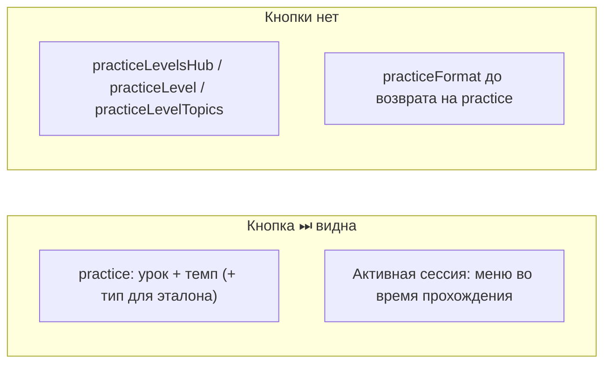
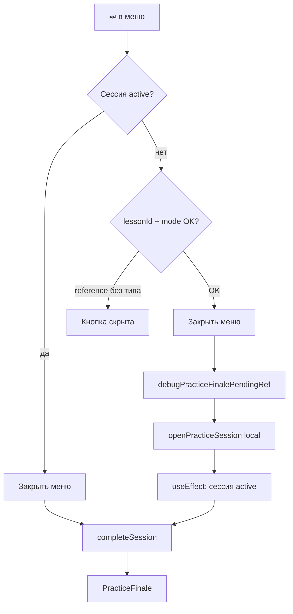

# Отладочная кнопка «финал практики» (⏭)

## Расположение кнопки

**Где:** верхняя панель бокового меню в [`MenuSectionPanels.tsx`](components/MenuSectionPanels.tsx) (~1536–1584), **сразу справа от «Домой»** (четвёртая кнопка в ряду):

`←` | `✕` | `⌂` | **`⏭`** ····················· `Практика`

Тот же `menuNavIconButtonClass`, что у соседних кнопок. Справа по-прежнему заголовок панели («Практика»).

**Не** в шапке приложения и **не** в ленте `PracticeScreen`.

## Когда кнопка видна (два момента)

### 1. Экран настройки практики (как на скриншоте)

Панель `lessonsPanel === 'practice'`: «Выберите урок и темп», строки Урок / Темп / (для эталона) Упражнение, кнопки «Запустить…».

⏭ появляется, когда конфигурация **готова к запуску** — те же условия, что у «Запустить практику» / «Запустить эталон»:

- выбран `selectedPracticeLessonId`
- выбран `selectedPracticeMode` (любой из 4: relaxed / balanced / challenge / reference)
- для **reference** — ещё `selectedReferenceExerciseType` (на скриншоте: «#1 Выбор варианта»)

На более ранних экранах (**уровни**, **темы**, **формат**) кнопки **нет** — пользователь ещё не на «финальном» экране выбора.

### 2. Во время прохождения практики

Пользователь нажал «Запустить…», сессия активна → открыл гамбургер → меню снова на панели `practice` ([`SlideOutMenu.tsx`](components/SlideOutMenu.tsx) ~202–205).

⏭ **всегда видна**, пока `session.status === 'active'` (`practiceSessionActiveForDebug`), независимо от текущего задания / briefing / feedback.

Действие: закрыть меню → сразу `completeSession()` → финал текущей сессии (режим уже в `session.mode`).



## Действие (единое для всех режимов)

`completeSession()` из [`usePracticeSession`](hooks/usePracticeSession.ts) — без ветвления по `mode`:

1. Сброс таймеров (checking / feedback / auto-advance).
2. `session.status = 'completed'`, `state = 'completed'`.
3. Рендер [`PracticeFinale`](components/practice/PracticeFinale.tsx) в [`PracticeScreen`](components/practice/PracticeScreen.tsx).
4. [`AppShell` useEffect](components/app/AppShell.tsx) (~4718) → `resolvePracticeCompletion` → награды / `practiceCompletionMeta`.

Работает из любого flow-state: `briefing`, `active`, `checking`, `feedback`, `correction`, `generating_next`.

## Четыре режима практики

| Режим | Заданий в сессии | Особенности при skip | Финал после skip |
|-------|------------------|----------------------|------------------|
| **Reference** (Эталон) | 7 одного типа | Нужен `referenceExerciseType` при старте из меню | 0 XP к уровню (`reference_mode`), CTA «Перейти в Challenge» |
| **Relaxed** (Лёгкая) | 6 | Локальная сборка вопросов | 0/N верно, CTA по `practiceFinaleCta` |
| **Balanced** (Обычная) | 9 | То же | То же |
| **Challenge** (Челлендж) | 12, boss | То же | «Повторить Challenge» / переход |

При skip без ответов: `score = 0`, `xp = 0`, `answers = []` — ожидаемо для отладки. Экономика считается от пустой сессии (минимальные награды).

### Reference — дополнительное условие в меню

На панели `practice` кнопка «Запустить эталон» disabled без `selectedReferenceExerciseType` ([`MenuSectionPanels.tsx`](components/MenuSectionPanels.tsx) ~2352). Для ⏭ — то же правило: в `debugSelectedPractice` для `mode === 'reference'` требовать `referenceExerciseType`.

Панели выбора:
- `practiceFormat` → reference уводит на `practiceReferenceType`
- `practiceReferenceType` → после выбора типа возврат на `practice`

⏭ из меню без активной сессии — только когда собран полный request (как у «Запустить практику»):
`{ lessonId, mode, entrySource: 'menu', referenceExerciseType? }`

## Два сценария вызова



### A. Активная сессия (основной сценарий отладки)

Пользователь в Reference / Relaxed / Balanced / Challenge → открывает меню → ⏭.

- `practiceSessionActiveForDebug = isPracticeActive && session.status === 'active'`
- Handler: закрыть меню → `completeSession()`
- Режим берётся из текущей сессии — отдельно передавать не нужно

### B. Из меню без сессии

Пользователь на панели `practice`, урок и формат выбраны, сессия не запущена.

- `debugSelectedPractice` memo (аналог `debugSelectedLearningLesson`)
- Handler: сохранить request в ref → `openPracticeSession(request)` → после старта effect вызывает `completeSession()`

**Не покрывается v1:** произвольная тема (custom topic на `practice`), quick_start, after_lesson — там другой entry flow.

## Условие показа кнопки

```tsx
onDebugSkipToPracticeFinale &&
(practiceSessionActiveForDebug || debugSelectedPractice)
```

- **`practiceSessionActiveForDebug`** — сценарий 2 (идёт практика)
- **`debugSelectedPractice`** — сценарий 1 (экран `practice`, конфиг готов к запуску)

Взаимоисключение с кнопкой урока: `debugSelectedLearningLesson` vs practice — одновременно не активны.

`debugSelectedPractice` только при `lessonsPanel === 'practice'` и валидном request (`entrySource: 'menu'`). Панель `practiceReferenceType` не нужна отдельно — после выбора типа пользователь возвращается на `practice` (как на скриншоте).

## Файлы

1. [`AppShell.tsx`](components/app/AppShell.tsx) — handler, ref, effect; правки через `safe-utf8-patch.mjs`
2. [`SlideOutMenu.tsx`](components/SlideOutMenu.tsx) — проброс props
3. [`MenuSectionPanels.tsx`](components/MenuSectionPanels.tsx) — `debugSelectedPractice`, кнопка ⏭

**Важно:** `MenuSectionPanels` монтируется в **двух местах** — домашний shell (~6978) и `SlideOutMenu` (~259). Props нужно пробросить в оба, иначе на стартовом экране (до `dialogStarted`) кнопки не будет.

## Детали реализации (проверка плана)

- **`completeSession`** уже есть в `usePracticeSession`, но в AppShell сейчас не деструктурирован — добавить в деструктуризацию `practiceSession`.
- **Handler: приоритет** — сначала проверить активную сессию (`session.status === 'active'`), и только потом старт из меню. Иначе при открытом меню во время практики можно случайно запустить вторую сессию.
- **`menuOpenSnapshotRef.current = null`** перед закрытием меню (как в `startPracticeFromLesson` ~3494) — иначе эффект снимка настроек может вызвать `abandonPracticeSession` и снести сессию.
- **`isPracticeActive`** = `dialogStarted && session != null` — включает и `completed`. Флаг `practiceSessionActiveForDebug` обязан проверять именно `status === 'active'`, не `isPracticeActive` (в плане верно).
- **После финала** (`status === 'completed'`) кнопка снова работает как сценарий B (старт + skip) — для отладки это ок.
- **Конфликт с уроком:** `debugSelectedLearningLesson` и practice не пересекаются по веткам UI — отдельная кнопка рядом, условия взаимоисключающие.
- **Сценарий B** использует `openPracticeSession` (local), не `generatePracticeSession` — совпадает с «Запустить практику», не с «Сгенерировать».

## Проверка

1. **Экран настройки (скриншот)** — Reference, урок + темп + упражнение → ⏭ справа от домика; без упражнения (reference) — скрыта.
2. **Во время практики** — гамбургер на любом задании → ⏭ на месте → финал.
3. **Relaxed / Balanced / Challenge** — на `practice` с выбранным уроком и форматом → ⏭; skip из сессии → финал с total 6/9/12.
4. **Уровни / формат** — на `practiceLevelsHub`, `practiceLevelTopics`, `practiceFormat` → ⏭ нет.
5. Кнопка урока на A1/A2 не сломана.
