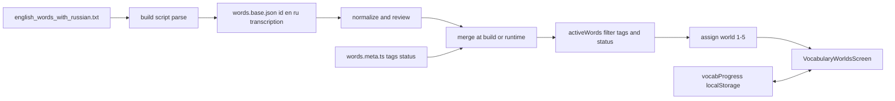

# План: раздел «Самые необходимые слова» (MyEng)

## Контекст проекта

- Точка входа и переключение режимов: [`app/page.tsx`](c:/dev/Cursor/my-eng-bot/app/page.tsx) — уже есть ветвление `isAccentActive` / `isPracticeActive` / уроки / чат.
- Меню «Уроки»: [`components/MenuSectionPanels.tsx`](c:/dev/Cursor/my-eng-bot/components/MenuSectionPanels.tsx) — тип [`LessonsPanel`](c:/dev/Cursor/my-eng-bot/components/MenuSectionPanels.tsx), список панелей и колбэки (`onOpenPracticeSession`, `onOpenAccentTrainer` и т.д.).
- Чат и протоколы: [`components/Chat.tsx`](c:/dev/Cursor/my-eng-bot/components/Chat.tsx), API [`app/api/chat/route.ts`](c:/dev/Cursor/my-eng-bot/app/api/chat/route.ts) — существующие режимы не трогаем; на этом заходе нужен только UI-выход в чат как заглушка.
- Паттерн локального прогресса: [`lib/practice/storage/practiceStorage.ts`](c:/dev/Cursor/my-eng-bot/lib/practice/storage/practiceStorage.ts) (отдельные ключи `localStorage`, версия payload).

Источник слов: [`english_words_with_russian.txt`](c:/dev/Cursor/my-eng-bot/english_words_with_russian.txt) — в файле **нет** полей `tags` / `status`; их нужно ввести **рядом** с распарсенными записями (merge по `id`). Для этого захода используется один очищенный набор «самых необходимых слов» без взрослого сленга и без отдельной взрослой ветки.

---

## Архитектура данных

1. **Парсинг TXT** (один раз в CI или `prebuild`): скрипт вроде [`scripts/parse-english-words.ts`](c:/dev/Cursor/my-eng-bot/scripts/parse-english-words.ts) → артефакт [`public/data/vocabulary/words.base.json`](c:/dev/Cursor/my-eng-bot/public/data/vocabulary/words.base.json) (или под `lib/vocabulary/`), формат строк: `id`, `en`, `ru`, `transcription`, `source`.
2. **Очистка словаря**: отдельный шаг нормализации, а не побочный эффект парсинга. Файл правил вроде [`lib/vocabulary/cleanupRules.ts`](c:/dev/Cursor/my-eng-bot/lib/vocabulary/cleanupRules.ts) и ручной review-слой вроде [`lib/vocabulary/reviewOverrides.ts`](c:/dev/Cursor/my-eng-bot/lib/vocabulary/reviewOverrides.ts) для:
   - удаления мусорных хвостов и случайно слипшихся заголовков;
   - исправления обрывочных или двусмысленных переводов;
   - пометки записей как `excluded`, `needsReview`, `duplicateOf`;
   - полного удаления взрослого сленга и спорных слов из этого упражнения.
3. **Метаданные и фильтрация**: файл [`lib/vocabulary/wordMeta.ts`](c:/dev/Cursor/my-eng-bot/lib/vocabulary/wordMeta.ts) или JSON по `id`: массив `tags`, редакторский `status` (`active`, `excluded`, `needsReview`), при необходимости `primaryWorld`. В активное обучение попадают только записи со `status: active`. `needsReview` по умолчанию не показывается.
4. **Единый набор «самых необходимых слов»**: в этом заходе делается только один продуктовый набор без child/adult split и без adult-режима. Название в UI и коде должно отражать именно «самые необходимые слова», а не «1000 слов».
5. **Пять миров**: модуль [`lib/vocabulary/worlds.ts`](c:/dev/Cursor/my-eng-bot/lib/vocabulary/worlds.ts) — функция `getWorldId(word): 1..5` по приоритету тегов (например: digital/social → мир 4, travel → 3, school/hobby → 2, home/family/body/food/animals → 1, иначе мир 5 «глаголы/грамматика/остаток»). Явно задокументировать приоритет, чтобы не дублировать слово в нескольких мирах.
6. **SRS и геймификация в хранилище**: [`lib/vocabulary/vocabularyStorage.ts`](c:/dev/Cursor/my-eng-bot/lib/vocabulary/vocabularyStorage.ts) — отдельный ключ (аналог practice), структура: по `wordId` — `ease`, `nextReviewAt`, `lastResult`; глобально — `coins`, `streak`, `unlockedWorld`, `level`. Интервалы 0→1→3→7→14→30 как в ТЗ.

---

## Контентная стратегия словаря

1. **Не считать исходный TXT финальным учебным словарём**. Это источник сырья, а не готовый учебный набор.
2. **Полностью удалить взрослый сленг из упражнения**. Не переносить его во взрослый режим и не держать в отдельной продуктовой ветке этого раздела.
3. **Убрать дубли, редкости и шум**. В разделе остаются только самые бытовые и реально полезные слова.
4. **Сохранить след происхождения слова**: чтобы в будущем понимать, из какого набора или редакторской правки пришла запись.
5. **В этом заходе не расширять продукт за пределы необходимых слов**. Будущие словари не реализуются и не встраиваются в UI сейчас.

---

## UI: отдельный раздел в меню

1. Расширить [`LessonsPanel`](c:/dev/Cursor/my-eng-bot/components/MenuSectionPanels.tsx) новым значением, например `vocabulary_worlds`, заголовок в `LESSONS_PANEL_TITLE`, пункт в сводке «Уроки» (карточка «Самые необходимые слова» / «Миры»).
2. В [`MenuSectionPanels.tsx`](c:/dev/Cursor/my-eng-bot/components/MenuSectionPanels.tsx) передать новый колбэк `onOpenVocabularyWorlds` (имя по вкусу).
3. В [`app/page.tsx`](c:/dev/Cursor/my-eng-bot/app/page.tsx):
   - состояние `vocabularySessionActive` (или зеркало паттерна практики);
   - обработчик открытия из меню: закрыть меню, выставить `dialogStarted` / маршрут экрана по тому же принципу, что у практики (см. `onBackToPracticeMenu`);
   - условный рендер **нового** корневого компонента, например [`components/vocabulary/VocabularyWorldsScreen.tsx`](c:/dev/Cursor/my-eng-bot/components/vocabulary/VocabularyWorldsScreen.tsx), **до** ветки с `Chat`, по аналогии с `PracticeScreen` / `AccentTrainer`.
4. Подсказка на главной: расширить [`lib/homeMenuInstruction.ts`](c:/dev/Cursor/my-eng-bot/lib/homeMenuInstruction.ts) для новой панели, если она доступна с главной ветки «Уроки».

Первый экран раздела: карта 5 миров (заблокирован следующий до порога по предыдущему), счётчик «выучено / всего в активном наборе», мягкий CTA «Сегодняшняя сессия».

Важно: все изменения ограничены только новым разделом «Самые необходимые слова». Существующие ветки, сценарии и режимы приложения не перерабатываются.

---

## Логика чата и «особое» внутри раздела

Цель — **не ломать** существующий поток [`AppMode`](c:/dev/Cursor/my-eng-bot/lib/types.ts) и не подмешивать карточки слов в парсеры протокола перевода в [`Chat.tsx`](c:/dev/Cursor/my-eng-bot/components/Chat.tsx).

Рекомендуемая связка из двух слоёв:

1. **Локальный «компаньон-чат» (без API)** внутри [`VocabularyWorldsScreen.tsx`](c:/dev/Cursor/my-eng-bot/components/vocabulary/VocabularyWorldsScreen.tsx): короткие реплики питомца по шагам сессии (приветствие → разминка → новые слова → мини-игра → прощание), визуально переиспользовать [`ChatBubbleFrame`](c:/dev/Cursor/my-eng-bot/components/chat/ChatBubble.tsx) / те же отступы и обои, что у чата (`bg-[linear-gradient(...)]` в `page.tsx`), чтобы ощущение было единым с приложением, но **без** записи в `messages` и без вызова `/api/chat`.
2. **Выход в чат как заглушка** после сессии (или из хаба мира): кнопка вроде «Поговорить с MyEng про сегодняшние слова» — пока только UI-заглушка с промптом/текстом-подсказкой для будущего перехода, без реального запуска `communication`, без изменений в API и без вмешательства в существующую чат-логику.

Так алгоритм приложения остаётся: главная → разделы; чат — отдельный поток с ИИ; миры слов — автономный клиентский цикл с локальным компаньоном и заглушкой выхода в чат.

---

## Мини-игры и голос (итерация 1)

- Первая итерация: **одна** простая механика (например выбор перевода / «картинка-заглушка») + экран «произнеси» с уже существующими хуками из [`lib/voice/useVoiceComposer.ts`](c:/dev/Cursor/my-eng-bot/lib/voice/useVoiceComposer.ts) или упрощённым Web Speech API, без строгой «ИИ-проверки» произношения.
- Остальные механики из ТЗ — следующими этапами, общий [`lib/vocabulary/sessionPlan.ts`](c:/dev/Cursor/my-eng-bot/lib/vocabulary/sessionPlan.ts) по аналогии с [`lib/practice/engine/sessionPlan.ts`](c:/dev/Cursor/my-eng-bot/lib/practice/engine/sessionPlan.ts).

---

## Статистика и локальная история

- Минимум: экран «Статистика» внутри раздела или ссылка из существующего [`MenuView` progress](c:/dev/Cursor/my-eng-bot/components/MenuSectionPanels.tsx) — чтение из `vocabularyStorage` (слова, стрик, монеты).
- История обучения хранится локально по схеме «мир → слово → попытки / повторения / дата следующего показа».
- Профиль и облачная синхронизация в этот заход не входят.

---

## Риски и порядок работ

- В начале TXT есть сленг и шум: без кураторства качество фильтра будет слабым — заложить **явный список id** для полного исключения взрослого сленга и спорных записей из упражнения.
- Производительность: не тащить весь JSON в клиентский бандл без нужды — отдавать из `public/data/...` с `fetch` + ленивая подгрузка по миру (как в ТЗ).
- Контентный риск выше технического: если не сделать явный этап очистки, ребёнок увидит слова, которые либо неинтересны, либо не подходят по возрасту, и сама игровая оболочка это не компенсирует.
- Риск расползания scope: изменения должны остаться внутри раздела «Самые необходимые слова» и не затронуть существующие режимы и ветки приложения.

## Definition of Done (релиз 1)

1. **Контент**:
   - сформирован единый набор «самых необходимых слов» с пометками `excluded`/`needsReview`;
   - взрослый сленг и спорные записи полностью удалены из упражнения;
   - для каждого слова определены `primaryWorld` и минимальные метаданные (`tags`, `status`);
   - записи со `status: needsReview` не попадают в активное обучение.
2. **Продуктовый поток**:
   - ребёнок может стартовать сессию из раздела миров без инструкции;
   - завершение сессии сохраняет прогресс и корректно меняет состояние карты мира;
   - есть мягкая обратная связь по ошибке без негативных формулировок;
   - после сессии показывается кнопка-заглушка выхода в чат с подготовленным текстом-промптом.
3. **Техника**:
   - прогресс после перезагрузки восстанавливается;
   - SRS выдаёт «слова к повторению» по интервалам 0/1/3/7/14/30;
   - словарь загружается лениво, без блокировки основного UI;
   - остальные режимы приложения не изменены.
4. **Качество**:
   - критические тесты из матрицы ниже проходят стабильно;
   - нет регрессии существующих режимов (`dialogue`, `translation`, `communication`, `practice`, `accent`);
   - по завершении работ подготовлен итоговый отчёт по выполнению.

## Матрица тестов (минимум для релиза 1)

1. `parse`:
   - корректный разбор стандартной строки;
   - устойчивость к строкам с мусорным хвостом и слипшимися заголовками;
   - стабильное поведение на невалидных строках (skip + лог причин).
2. `cleanup`:
   - применение `cleanupRules` и `reviewOverrides`;
   - корректная обработка `duplicateOf`, `excluded`, `needsReview`.
3. `filter`:
   - активный фильтр исключает взрослый сленг, спорные записи и `needsReview`;
   - в выборку попадают только слова со `status: active`.
4. `worlds`:
   - детерминированное назначение `primaryWorld`;
   - fallback-поведение при конфликте тегов.
5. `SRS`:
   - переходы интервалов успех/ошибка;
   - корректный выбор `dueWords`.
6. `storage`:
   - сохранение/чтение истории по словам;
   - миграция версии схемы без потери валидных данных.
7. `ui-stub`:
   - кнопка выхода в чат показывает заглушку и не затрагивает существующий `communication` поток.

## Балансировка миров

1. Ввести целевые квоты по каждому миру в наборе «самых необходимых слов» и нижнюю границу минимума слов на мир.
2. Если мир не набирает квоту после фильтрации:
   - использовать fallback-правило `secondaryWorld`;
   - если дефицит остаётся, помечать мир как `contentGap` для редакторского добора.
3. Сохранять для слова один `primaryWorld`, чтобы не дублировать карточку в нескольких мирах.

## Версионирование словаря и миграции

1. Добавить `dictionaryVersion` и `schemaVersion` в словарные данные и storage.
2. Для изменений словаря фиксировать миграции:
   - `renamedWordId`;
   - `mergedWordIds`;
   - `removedWordId`.
3. При изменении состава необходимых слов не переносить прогресс автоматически без явного правила миграции.
4. Вести журнал миграций для диагностики, чтобы понимать причину пропажи/переноса прогресса.

## Режим выполнения

1. Реализация идёт **в один проход**: все блоки плана, включая тесты, выполняются в рамках одной рабочей итерации.
2. После завершения нужен **итоговый отчёт**:
   - что сделано;
   - какие файлы изменены;
   - какие тесты запущены;
   - что осталось вне scope.
3. Любые изменения за пределами раздела «Самые необходимые слова» считаются отклонением от плана и не допускаются без нового согласования.

## Порядок этапов

1. Сначала подготовить словарный фундамент: parse → cleanup → meta → worlds.
2. Затем сделать storage и SRS.
3. После этого встроить раздел в меню и `page.tsx`, не меняя остальные ветки.
4. Потом собрать первую игровую итерацию: карта миров, короткая сессия, озвучка, мягкий фидбэк.
5. В конце добавить заглушку выхода в чат, прогнать все тесты из матрицы и подготовить итоговый отчёт.
