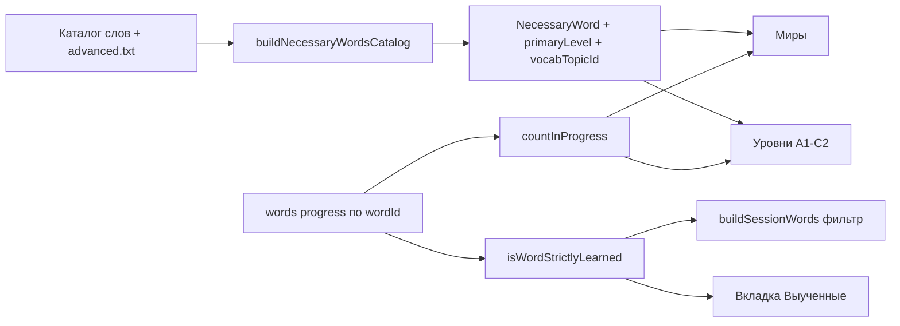

# План: слова по уровням A1–C2 + выученные слова

## Статус проверки плана

- Архитектура (глобальный прогресс по `wordId`) согласована с [`lib/vocabulary/storage.ts`](lib/vocabulary/storage.ts).
- Источник слов: формат строк совместим с [`lib/vocabulary/parser.ts`](lib/vocabulary/parser.ts).
- В репозитории уже есть канон CEFR — [`lib/cefr/cefrConfig.ts`](lib/cefr/cefrConfig.ts) и `CEFR_Levels.xlsx`; классификатор уровня желательно опирать на него, чтобы не плодить вторую «правду» только эвристиками.
- Уточнение по порогам (согласовано с пользователем): **два понятия** — «в прогрессе» (мягко, для счётчиков на карточках) и «выучено» (строго: фильтр в SRS-сессиях + попадание во вкладку «Выученные»).

## Два понятия прогресса

| Понятие | Назначение | Критерий (черновик для реализации) |
|--------|------------|-----------------------------------|
| В прогрессе | Счётчик «Пройдено слов: X / Y» на карточках миров и уровней/тем | Как сейчас: `(progress.words[id]?.successes ?? 0) > 0` |
| Выучено | Исключение из новых сессий + список «Выученные» | Отдельный helper `isWordStrictlyLearned` — например `stage >= 4` и `successes >= 3` (точные числа зафиксировать в `lib/vocabulary/learned.ts` и тестах) |

- [`buildSessionWords`](lib/vocabulary/srs.ts) (алиас к текущему `buildWorldSessionWords`) фильтрует только **строго выученные** слова.
- Счётчики на карточках используют **мягкий** критерий.

## Архитектура (данные и экраны)

## 1. Типы

Файл: [`types/vocabulary.ts`](types/vocabulary.ts)

- `VocabularyLevelId = 'a1' | 'a2' | 'b1' | 'b2' | 'c1' | 'c2'`
- `VocabularyTopicId` — тематические разделы внутри уровня (travel, food, work, family, health, tech, education, culture, core и т.д.). **Имя поля в словаре:** `vocabularyTopic` / `primaryVocabularyTopic`, чтобы не путать с `primaryTopic` репетитора в приложении.
- `NecessaryWord`: добавить `primaryLevel`, опционально `secondaryLevel`, `primaryVocabularyTopic`, опционально `secondaryVocabularyTopic`.
- `NecessaryWordsCatalog`: массивы определений уровней и тем для UI.
- **История сессий:** расширить `VocabularySessionHistoryItem` — не только `worldId`. Вариант: `route: { kind: 'world'; worldId } | { kind: 'level'; levelId: VocabularyLevelId; topicId: VocabularyTopicId }`. Иначе статистика «по миру» ломается для сессий уровня.

## 2. Классификация и сборка

- Новый [`lib/vocabulary/levels.ts`](lib/vocabulary/levels.ts): подписи уровней (A1 - начальный … C2 - в совершенстве), `inferLevel(word)`.
- Новый [`lib/vocabulary/topics.ts`](lib/vocabulary/topics.ts): `VOCABULARY_TOPICS`, keyword-map, `inferVocabularyTopic(word)`.
- [`lib/vocabulary/catalog.ts`](lib/vocabulary/catalog.ts): вызов infer рядом с `inferWorlds`.
- [`scripts/build-necessary-words.ts`](scripts/build-necessary-words.ts): опционально читать `english_words_advanced.txt` (тот же формат); **id строго больше max id базового файла**; обновить тесты, завязанные на фиксированные id.
- Новый [`lib/vocabulary/learned.ts`](lib/vocabulary/learned.ts): `isWordInProgress`, `isWordStrictlyLearned`, хелпер для вкладки «Выученные».

## 3. SRS

- [`lib/vocabulary/srs.ts`](lib/vocabulary/srs.ts): переименовать/обернуть `buildWorldSessionWords` → `buildSessionWords`, внутри отфильтровать слова с `isWordStrictlyLearned`.

## 4. UI

- Новый экран [`components/vocabulary/VocabularyByLevelScreen.tsx`](components/vocabulary/VocabularyByLevelScreen.tsx): вкладки «Уровни» | «Выученные»; уровень → темы → «Играть» (та же фазовая сессия, что у миров).
- Рефакторинг сессии: общий хук/модуль с логикой фаз (желательно поэтапно: сначала рабочий экран уровней, затем вынос дублирования из [`VocabularyWorldsScreen.tsx`](components/vocabulary/VocabularyWorldsScreen.tsx), чтобы снизить регрессию).
- [`components/MenuSectionPanels.tsx`](components/MenuSectionPanels.tsx): пункт «Слова по уровням (A1-C2)».
- [`app/page.tsx`](app/page.tsx): флаг режима, dynamic import, footer/title, условие `overflow` как для vocabulary: `dialogStarted && !isVocabularyActive && !isVocabularyByLevelActive` → `overflow-hidden`.

## 5. Сопутствующие правки

- [`scripts/export-necessary-words-txt.ts`](scripts/export-necessary-words-txt.ts): экспорт/сводка по уровню и теме.
- Документация в плане: для уровней **нет** отдельной цепочки `unlockWorld` — только бейдж «Скоро», если в каталоге нет слов для уровня/темы.

## 6. Тесты

- Уровни/темы: эталонные слова.
- `isWordStrictlyLearned` / фильтр в `buildSessionWords`.
- Слово со strict-learned не попадает в сессию ни мира, ни уровня; мягкий счётчик может отличаться от strict списка.
- История: запись сессии уровня не ломает нормализацию в [`lib/vocabulary/storage.ts`](lib/vocabulary/storage.ts).

## Out of scope

- Серверный API; админка разметки; изменение сценариев диалога/практики вне словаря.

## Чеклист задач

- [ ] Типы + расширение history под route world | level
- [ ] levels.ts, topics.ts, learned.ts (два критерия)
- [ ] catalog + build script + advanced.txt + обновить catalog/export тесты
- [ ] srs: buildSessionWords + фильтр strict
- [ ] VocabularyByLevelScreen + меню + page.tsx
- [ ] Миры: счётчики на мягком, сессии на strict (при необходимости явно подписать в UI разницу позже)
- [ ] Тесты кросс-маршрута и нормализации history
